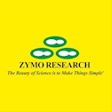
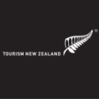
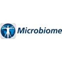

# Agenda
## Day 1: Wednesday August 12 - Genomic Standards in Indigenous contexts
* Themes: Oceania genomics & Indigenous metadata; Access and benefit sharing and biocultural stewardship; Regulations
* Pōwhiri welcome
* GSC welcome [Lynn Schriml](https://www.medschool.umaryland.edu/profiles/schriml-lynn/), [GSC](https://www.gensc.org/) President (University of Maryland School of Medicine)
* Keynote: [Amanda Black](https://researchers.lincoln.ac.nz/amanda.black) (Lincoln University) Indigenous Data Governance: Data Standards in Indigenous contexts 
* Session Themes: Oceania genomics & Indigenous metadata; Access and benefit sharing and biocultural stewardship; Regulations
* Speakers
* [Maui Hudson](https://www.linkedin.com/in/mauihudson/) (University of Waikato) CARE Principles
* [Neil Davies](https://moorea.berkeley.edu/people/Neil-Davies) (UC Berkeley) CARE/FAIR Use Cases
* [Kris Locken](https://www.linkedin.com/in/kristopher-locken-a5a071a3/) ([Zymo Research](https://www.zymoresearch.com/?srsltid=AfmBOop13fdu2SJlLCxy_SkM__KTaV-fJ1WIHHDXuaNZmWgLFvClBfV8)) Platinum Sponsor

## Day 2: Thursday August 13 - Genomic Standards
* Themes: GSC Standards; Single-cell, eDNA, ancient DNA Standards; Standards Across Genomic Repositories & DNA reference databases: Partnership models & LISTEN principles
*Speakers
* [Montana Smith](https://www.linkedin.com/in/montana-smith-426994234/) ([NMDC](https://www.linkedin.com/in/montana-smith-426994234/)) GSC MIxS v7.0
* [Tina Warinner](https://www.linkedin.com/in/christina-warinner-0b6bb418/) (Harvard University) Ancient DNA (aDNA) MInAS update
* [Tanja Woyke](https://www.linkedin.com/in/tanja-woyke-4537459/) (DOE, Joint Genome Institute) Single-cell genomic standards
* [Phil Wilcox](https://www.otago.ac.nz/maths-and-stats/people/associate-professor-phillip-wilcox) (University of Otago, University of Auckland) Omic Observing and Reference Databases: [Rakeiora](https://rakeiora.ac.nz/)
* [Jodie Van De Kamp](https://www.linkedin.com/in/jodie-van-de-kamp-b24088a4/) (CSIRO) Australian Microbiome
* [Chris Meyer](https://www.linkedin.com/in/chris-meyer-9102414b/) (Smithsonian's National Museum of Natural History) Ocean Biomolecular Observing Network (OBON)
* [Claire Rye](https://www.linkedin.com/in/claire-rye-b390bb66/) (University of Auckland, [Aotearoa Genomic Data Repository](https://data.agdr.org.nz/)); [Mik Black](https://www.otago.ac.nz/faculty-biomedical-sciences/expertise/profile?id=352) ([Genomics Aotearoa](https://www.genomics-aotearoa.org.nz/)); [Libby Liggins](https://profiles.auckland.ac.nz/libby-liggins) (University of Auckland) Sequence Repositories: Aotearoa Genomic Database
* [Ilene Mizrachi](https://www.linkedin.com/in/ilene-mizrachi-a7167717/) (NIH/NCBI GenBank) INSDC future 

**Evening Networking**: 
*[Thursday night market](https://www.rotoruanz.com/visit/listing/things-to-do/rotorua-night-market)

## Day 3: Friday August 14 - Ethical, Legal, and Social Context
* Themes: Ethical, Legal, and Social metadata; Standards for Bioconvergence: Genomics and AI;
* [Erin Robinson](https://www.linkedin.com/in/erinmr/) (Metadata Game Changers) Building place-based data trusts (iPlaces)

* Afternoon: Standards Development Workshops

 

## Thank you to our sponsors

	

 

