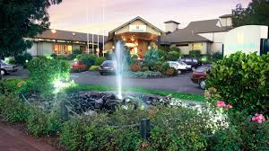
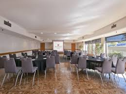

# [Millennium Hotel Rotorua](https://www.millenniumhotels.com/en/rotorua/millennium-hotel-rotorua/)

A resort hotel with unique architectural design, located near shores of Lake Rotorua, government gardens & commercial center. Centrally located, Millennium Hotel Rotorua is ideal as an international conference venue and base from which to
enjoy the many superb activities available in this diverse region. Offering deluxe accommodation and warm,
hospitable service.
Millennium Hotel Rotorua offers a comprehensive conference experience with seven air-conditioned rooms,
Wi-Fi, and capacity for up to 350 guests, complemented by an expert team adept at organizing both indoor and
outdoor events. Emphasizing eco-sensitivity, the hotel is smoke-free and utilizes geothermal heating.

*FACILITIES AND SERVICES*

• Restaurant Nikau \
• Brasserie Poolside Restaurant \
• Bar Zazu \
• Wireless internet throughout the hotel \
• Communal hot pools \
• In-house day spa for beauty and massage \
• Complimentary off-street parking \
• 15m thermally heated all weather swimming pool \
• Free, off street parking. \

*Location:* 1270 Hinemaru Street PO Box 1044 Rotorua, New Zealand 3010 \
*Phone:* +64 7 347 1234

[GSC26 Google Map](https://maps.app.goo.gl/66VKmGdfh63EQCAt9)

## Meeting Room:

*Mokoia Room* \
Large, versatile and functional, the Mokoia Room seats up to 350. It has a full stage, projection room, feature lighting, and Wi-Fi capability. It's an ideal space for corporate conferences and grand wedding banquets. \
Area: 225 sqm / 2422 sq ft \
Capacity: 350 \

## [About Genomic Standards Consortium](https://www.gensc.org/)

